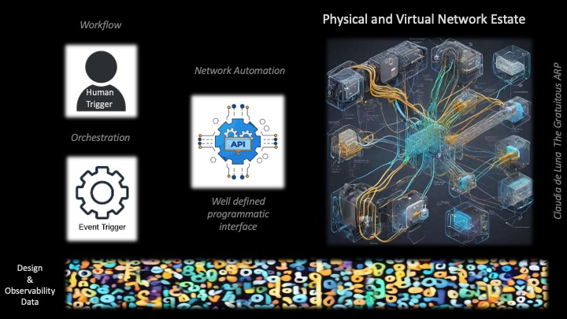

# Simplifying Network Automation with NetGru
## *... with Cisco DevNet's **Adrian Iliesiu***

### Network Port Self Service - Its not a fantasy

*Claudia de Luna*

Changing the vlan on a network interface is a common network operations activity and I rarely see this function automated!  I get it.

It sounds like a trivial problem but often it is not.

Generally we see:

1. The fear of a change in process
2. The fear of taking the network engineer out of the equation
3. The fear of something going wrong
4. The lack of confidence

Specifically

- Sometimes a user does not know what switch and port their device is connected to
- Sometimes the vlan they need is not on the switch (or is not configured correctly on the switch)

The systems and tooling to automate this workflow with sufficient guardrails and with full documentation have not been readily available in the past.  However, we are living in a different world now.

It is the perfect time tackle the general and specific issues.   Observability platforms are a big part of making safer and easier.

I've gotten into the habbit of asking: 
"Under what conditions would you let your users change the vlan on their network port?"

I firmly believe that 99% of the time the user would benefit from having this capability. 

- Their needs are met immediately and safely.  
- The IT organization shines and their resources are not wasted on well known, low risk actions.  

So many good things can come from offering a service like this and yet many organizations think this type of user self service can only lead to disaster or that it is a fantasy, only available in the realm of unicorns and rainbows.

---

## Key Topics

1. The definition of Network Automation
2. The business case for this "service"
3. Business Logic and Technical "Guardrails"
4. System Requirements
5. Review of the functional components 
6. Implementation
7. Lessons Learned

### 1. Network Automation Defined

https://gratuitous-arp.net/definition-of-network-automation/

**Network Automation is the act of establishing those skills, tools, data, and workflows necessary**
**- to provide a programmatic interface** 
**- for authorized operators** 
**- to interact with the organization's network infrastructure.**

**This act effectively builds a programmatic interaction “service” or "uber-API" to the network so that actions act uniformly across one or many elements of an organization's network estate.**

The service may be exposed via various UX models including API, GUI, and CLI which can then be efficiently consumed across the entire organization and in orchestration actions.

Orchestration can choreograph one or more of these network automation ”services” to provide a cross-organizational service to their user community or to other parts of the IT Organization.

Does this sound like software development? It should because IT IS!

### 2. The business case for this "service"

General

- Customer satisfaction
- Operator workload reduction
- Program satisfaction

Specific

- A security initiative led to a dramatic increase in the rate of port changes (MACs in the Moves/Adds/Changes sense not media access control ) for an organization
- A small IT team was buckling under the demand for MACs and automating a percentage of requests which met certain criteria lessened the load and I am certain will pave the way for more automation

### 3. Business Logic and Technical "Guardrails"

This will be different for every organization.  Examples include:

- The user must be authorized on the system
- The user may need to also be authorized for a location or a vlan or...
- Minimum manual input
- The Vlan must exist and be functional
- Only "user" ports can be changed
- These critical vlans cannot be changed
- Changes cannot be made on these dates
- Only devices in this list of Vendor OUIs can be changed
- Only these infrastructure switches are available for self service
- If there is an LLDP/CDP Neighbor that is not a phone do not make any changes
- If the selected vlan is in the "critical vlan" list, do not make any changes
- if the Device cannot be found with 100% certainty, do not make any changes

### 4. System Requirements

The system:

- shall offer a GUI interface
- shall offer an API
- shall require authentication
- user must be authorized on the system and at the location
- shall offer an initial input field for MAC address, IP address, or Fully Qualified Domain which will be used to identify the switch and port to which the device is connected. 
- shall validate initial input for syntax (valid MAC, IP, FQDN format)
- shall validate initial input for context (Is this IP vaid at this location, is this a valid domain for the system)
- shall offer a curated list of locations based on the user
- shall offer a curated list of access switches at the location
- shall offer a curated list of vlans available at the location
- shall provide the user with the history of the device

The system interfaces:

- Code Base Repository
- Ticketing system
- Observability System
- Intent Data Store
- Authentication System (production only).  Special Account.
- Web Server (production only)
- Server or Servers

### 5. Review of the functional components 

| Component                               | Product or System                                |
| --------------------------------------- | ------------------------------------------------ |
| Code Base Repository                    | Python in GitHub Repository                      |
| Ticketing system                        | Service Now (Developer Instance)                 |
| Observability System                    | SuzieQ                                           |
| Intent Data Store                       | Suzieq Enterprise ("off label") InfraHub or YAML |
| Authentication System (production only) | Streamlit                                        |
| Web Server (production only)            | Streamlit                                        |

### 6. Implementation

Slides, Code Review, and Discussion

### 7. Lessons Learned

1. Prepare to be wildly successful and make sure you think about how to authorize the user and train the user on the system
2. Prepare to support the API as other projects will want to use the system so they can "self serve" for their own projects
3. Prepare the guardrails to grow but also diminish.  You will spend most of your time here.
4. Authentication and Authorization will be tricky
5. Think about rollback
6. Do everything you can to minimize manual input
7. Think about the support and resource model before you write your first line of code

